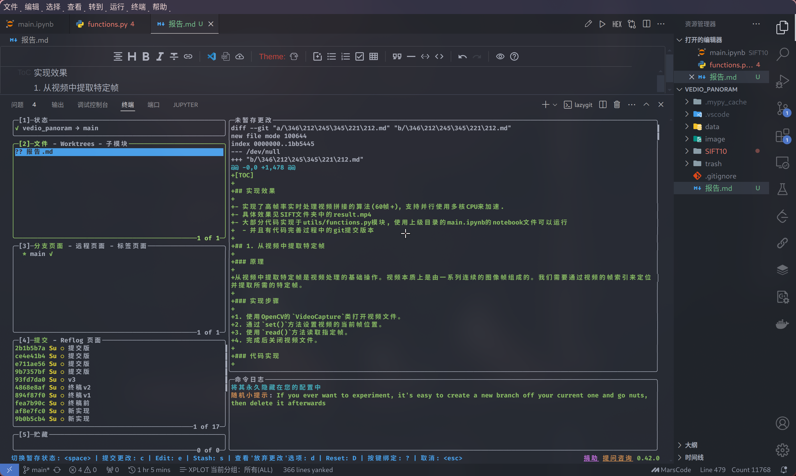

[TOC]

## 实现效果

- 实现了高帧率实时处理视频拼接的算法(60帧+), 支持并行使用多核CPU来加速.
- 具体效果见SIFT文件夹中的result.mp4
- 大部分代码实现于utils/functions.py模块, 使用上级目录的main.ipynb的notebook文件可以运行
  - 并且有代码完善过程中的git提交版本

## 1. 从视频中提取特定帧

### 原理

从视频中提取特定帧是视频处理的基础操作。视频本质上是由一系列连续的图像帧组成的。我们需要通过视频的帧索引来定位并提取所需的特定帧。

### 实现步骤

1. 使用OpenCV的`VideoCapture`类打开视频文件。
2. 通过`set()`方法设置视频的当前帧位置。
3. 使用`read()`方法读取指定帧。
4. 完成后关闭视频文件。

### 代码实现

```python
def read_frame(video_path: str, frame_number: int) -> np.ndarray:
    cap = cv.VideoCapture(video_path)
    cap.set(cv.CAP_PROP_POS_FRAMES, frame_number)
    ret, frame = cap.read()
    if not ret:
        raise ValueError(f"无法从 {video_path} 提取帧 {frame_number}")
    cap.release()
    return frame
```

这个函数通过设置`CAP_PROP_POS_FRAMES`属性来定位到指定的帧，然后读取该帧。如果读取失败，会抛出异常。

## 2. 对图像进行预处理，包括畸变矫正和旋转

### 原理

#### 畸变矫正

相机镜头会引入两种主要的畸变：径向畸变和切向畸变。

1. 径向畸变：使图像中心周围的像素位置发生变化。可以用多项式模型描述：

   $x_{corrected} = x(1 + k_1r^2 + k_2r^4 + k_3r^6)$
   $y_{corrected} = y(1 + k_1r^2 + k_2r^4 + k_3r^6)$

   其中，$(x, y)$是原始坐标，$(x_{corrected}, y_{corrected})$是校正后的坐标，$r = \sqrt{x^2 + y^2}$，$k_1, k_2, k_3$是径向畸变系数。

2. 切向畸变：使图像看起来有些倾斜。可以用以下公式描述：

   $x_{corrected} = x + [2p_1xy + p_2(r^2 + 2x^2)]$
   $y_{corrected} = y + [p_1(r^2 + 2y^2) + 2p_2xy]$

   其中，$p_1$和$p_2$是切向畸变系数。

#### 图像旋转

图像旋转通过旋转矩阵实现。对于角度$\theta$的旋转，旋转矩阵为：

$R = \begin{bmatrix} 
\cos\theta & -\sin\theta \\
\sin\theta & \cos\theta 
\end{bmatrix}$

### 实现步骤

1. 使用相机内参矩阵和畸变系数进行畸变矫正。
2. 计算旋转矩阵。
3. 应用旋转变换。

### 代码实现

```python
def undistort_and_rotate(image: np.ndarray, dist_coeffs: np.ndarray, camera_matrix: np.ndarray, angle: float = 0) -> np.ndarray:
    new_camera_matrix, roi = cv.getOptimalNewCameraMatrix(camera_matrix, dist_coeffs, (image.shape[1], image.shape[0]), 1, (image.shape[1], image.shape[0]))
    undistorted_image = cv.undistort(image, camera_matrix, dist_coeffs, None, new_camera_matrix)
    x, y, w, h = roi
    undistorted_image = undistorted_image[y:y+h, x:x+w]
    (h, w) = undistorted_image.shape[:2]
    center = (w // 2, h // 2)
    M = cv.getRotationMatrix2D(center, angle, 1.0)
    rotated_image = cv.warpAffine(undistorted_image, M, (w, h), flags=cv.INTER_LINEAR, borderMode=cv.BORDER_CONSTANT, borderValue=(0, 0, 0))
    return rotated_image
```

这个函数首先使用`cv.undistort()`进行畸变矫正，然后使用`cv.getRotationMatrix2D()`和`cv.warpAffine()`进行图像旋转。

## 3. 检测和计算图像特征点及其描述子

### 原理

特征点检测和描述是图像匹配的关键步骤。常用的算法包括SIFT（尺度不变特征变换）和ORB（定向FAST和旋转BRIEF）。

#### SIFT算法原理

SIFT算法主要包括以下步骤：

1. 尺度空间极值检测：使用高斯差分（DoG）金字塔检测潜在的兴趣点。
   
   $D(x,y,\sigma) = (G(x,y,k\sigma) - G(x,y,\sigma)) * I(x,y) = L(x,y,k\sigma) - L(x,y,\sigma)$

   其中，$G$是高斯核，$I$是输入图像，$L$是高斯模糊后的图像。

2. 关键点定位：精确定位关键点，并剔除低对比度和不稳定的边缘点。

3. 方向分配：为每个关键点分配一个或多个方向，以实现旋转不变性。

4. 关键点描述子：在关键点周围的邻域内计算局部图像梯度，形成描述子。

### 实现步骤

1. 创建SIFT或ORB检测器。
2. 使用检测器的`detectAndCompute()`方法同时检测关键点和计算描述子。
3. 可选：根据指定的横坐标范围筛选关键点。

### 代码实现

```python
def detect_and_compute_features(img: np.ndarray, method: str = 'SIFT', x_range: List[float] = [0.0, 1.0]) -> Tuple[List[cv.KeyPoint], np.ndarray]:
    if method == 'ORB':
        detector = cv.ORB_create()
    elif method == 'SIFT':
        detector = cv.SIFT_create()
    else:
        raise ValueError("method 参数必须是 'ORB' 或 'SIFT'")

    keypoints, descriptors = detector.detectAndCompute(img, None)

    # 筛选指定横坐标范围内的特征点
    img_width = img.shape[1]
    x_min, x_max = x_range[0] * img_width, x_range[1] * img_width
    filtered_keypoints = [kp for kp in keypoints if x_min <= kp.pt[0] <= x_max]
    filtered_descriptors = descriptors[[keypoints.index(kp) for kp in filtered_keypoints]]

    return filtered_keypoints, filtered_descriptors
```

这个函数允许选择SIFT或ORB算法，并可以根据指定的横坐标范围筛选特征点

## 4. 匹配两个图像的特征描述子，获取匹配点

### 原理

特征匹配是图像拼接中的关键步骤，其目标是在两幅图像中找到对应的特征点。这个过程涉及比较两幅图像中特征点的描述子，找出最相似的对应关系。常用的方法包括暴力匹配和基于FLANN（快速最近邻搜索库）的匹配。

#### FLANN匹配原理

FLANN（Fast Library for Approximate Nearest Neighbors）使用多维空间中的树结构（如k-d树或k-means树）来加速最近邻搜索。对于高维特征描述子，FLANN比暴力匹配更高效。

FLANN的核心思想是通过预处理和索引结构来减少搜索空间。对于给定的查询点，FLANN可以快速定位到可能的最近邻区域，而不需要遍历整个数据集。

### 数学模型

假设我们有两组特征描述子 $D_1 = \{d_1^1, d_1^2, ..., d_1^m\}$ 和 $D_2 = \{d_2^1, d_2^2, ..., d_2^n\}$，其中每个 $d_i^j$ 是一个 $k$ 维向量。

1. **距离度量**：通常使用欧氏距离来衡量两个描述子的相似度：

   $dist(d_1^i, d_2^j) = \sqrt{\sum_{k=1}^K (d_1^i[k] - d_2^j[k])^2}$

2. **K近邻搜索**：对于 $D_1$ 中的每个描述子 $d_1^i$，找到 $D_2$ 中距离最小的 $K$ 个描述子。

3. **比率测试**：Lowe's 比率测试用于筛选高质量匹配。对于 $D_1$ 中的描述子 $d_1^i$，如果它在 $D_2$ 中的最近邻 $d_2^j$ 和次近邻 $d_2^k$ 满足：

   $\frac{dist(d_1^i, d_2^j)}{dist(d_1^i, d_2^k)} < threshold$

   则认为这是一个好的匹配。通常 $threshold$ 设置为 0.7 或 0.8。

### 实现步骤

1. 初始化FLANN匹配器：
   - 选择索引算法（如k-d树）
   - 设置搜索参数

2. 使用KNN（K近邻）匹配每个特征点的最佳两个匹配。

3. 应用Lowe's比率测试来筛选高质量匹配。

### 代码实现

```python
def match_features(descriptors1: np.ndarray, descriptors2: np.ndarray) -> List[cv.DMatch]:
    FLANN_INDEX_KDTREE = 0
    index_params = dict(algorithm=FLANN_INDEX_KDTREE, trees=5)
    search_params = dict(checks=50)
    flann = cv.FlannBasedMatcher(index_params, search_params)

    matches = flann.knnMatch(descriptors1, descriptors2, k=2)
    good_matches = [m for m, n in matches if m.distance < 0.65 * n.distance]

    return good_matches
```

这个函数实现了基于FLANN的特征匹配：

1. 首先，设置FLANN参数。`FLANN_INDEX_KDTREE = 0` 表示使用k-d树算法，`trees=5` 指定构建5棵随机k-d树。

2. `search_params` 中的 `checks=50` 指定在每棵树中遍历的最大叶子数。增加这个值可以提高精度，但会降低速度。

3. `flann.knnMatch(descriptors1, descriptors2, k=2)` 对每个查询描述子找到2个最近邻。

4. 最后应用Lowe's比率测试，这里使用0.65作为阈值。这个阈值比通常的0.7或0.8更严格，可能会得到更少但更可靠的匹配。

这种方法能够有效地在大规模特征集中快速找到高质量的匹配，为后续的图像拼接提供可靠的对应点。

## 5. 计算单应性矩阵

### 原理

单应性矩阵是描述两个平面之间投影关系的3x3矩阵。在图像拼接中，它用于将一幅图像中的点映射到另一幅图像中的对应点。

单应性矩阵 $H$ 定义如下：

$\begin{bmatrix} x' \\ y' \\ 1 \end{bmatrix} = H \begin{bmatrix} x \\ y \\ 1 \end{bmatrix} = \begin{bmatrix} h_{11} & h_{12} & h_{13} \\ h_{21} & h_{22} & h_{23} \\ h_{31} & h_{32} & h_{33} \end{bmatrix} \begin{bmatrix} x \\ y \\ 1 \end{bmatrix}$

其中 $(x, y)$ 是原图像中的点，$(x', y')$ 是变换后图像中的对应点。

### RANSAC算法

随机抽样一致性（RANSAC）算法用于在存在噪声和异常值的数据中估计单应性矩阵。其步骤如下：

1. 随机选择最小数量的点对（对于单应性矩阵，需要4对点）。
2. 使用这些点计算单应性矩阵。
3. 计算所有其他点对的投影误差。
4. 统计内点（误差小于阈值的点）的数量。
5. 重复步骤1-4多次，选择具有最多内点的模型。
6. 使用所有内点重新估计最终的单应性矩阵。

### 实现步骤

1. 从匹配点中提取坐标。
2. 使用OpenCV的`findHomography`函数，该函数内部使用RANSAC算法。
3. 返回计算得到的单应性矩阵。

### 代码实现

```python
def compute_homography(kp1: List[cv.KeyPoint], kp2: List[cv.KeyPoint], matches: List[cv.DMatch], min_match_count: int = 10) -> Optional[np.ndarray]:
    if len(matches) >= min_match_count:
        src_pts = np.float32([kp1[m.queryIdx].pt for m in matches]).reshape(-1, 1, 2)
        dst_pts = np.float32([kp2[m.trainIdx].pt for m in matches]).reshape(-1, 1, 2)
        H, mask = cv.findHomography(src_pts, dst_pts, cv.RANSAC, 5.0)
        return np.linalg.inv(H)
    else:
        print("匹配点不足！")
        return None
```

这个函数首先检查是否有足够的匹配点，然后使用`cv.findHomography`计算单应性矩阵。返回的是逆矩阵，因为我们需要将第二幅图像变换到第一幅图像的坐标系中。

## 6. 使用单应性矩阵变换图像并进行拼接

### 原理

图像拼接的核心是将一幅图像通过单应性变换映射到另一幅图像的坐标系中，然后将两幅图像合并。这个过程涉及图像的几何变换和像素重采样。

#### 单应性变换

单应性变换是一种保持直线的投影变换。它可以用3x3矩阵表示：

$$
H = \begin{bmatrix} 

h_{11} & h_{12} & h_{13} \\

h_{21} & h_{22} & h_{23} \\

h_{31} & h_{32} & h_{33}

\end{bmatrix}
$$


对于图像中的任意点 $(x, y)$，其在变换后图像中的对应点 $(x', y')$ 可以通过以下公式计算：

$$
\begin{bmatrix} 

x' \\

y' \\

w

\end{bmatrix} = H \begin{bmatrix} 

x \\

y \\

1

\end{bmatrix}
$$


其中，

$x' = \frac{h_{11}x + h_{12}y + h_{13}}{h_{31}x + h_{32}y + h_{33}}$

$y' = \frac{h_{21}x + h_{22}y + h_{23}}{h_{31}x + h_{32}y + h_{33}}$

#### 像素重采样

在进行图像变换时，变换后的坐标通常不是整数。因此，我们需要进行像素重采样。常用的方法包括最近邻插值、双线性插值和双三次插值。OpenCV的`warpPerspective`函数默认使用双线性插值。

双线性插值的公式如下：

$f(x,y) \approx f(0,0)(1-x)(1-y) + f(1,0)x(1-y) + f(0,1)(1-x)y + f(1,1)xy$

其中，$f(x,y)$ 是插值结果，$(x,y)$ 是浮点坐标，$f(0,0)$, $f(1,0)$, $f(0,1)$, $f(1,1)$ 是周围四个整数坐标点的像素值。

### 实现步骤

1. 使用`cv.warpPerspective`函数将第二幅图像变换到第一幅图像的坐标系。

   

   $dst(x,y) = src(\frac{h_{11}x + h_{12}y + h_{13}}{h_{31}x + h_{32}y + h_{33}}, \frac{h_{21}x + h_{22}y + h_{23}}{h_{31}x + h_{32}y + h_{33}})$

2. 创建一个足够大的画布，能容纳两幅图像。画布大小通常设置为：

   

   $width_{canvas} = width_1 + width_2$

   $height_{canvas} = max(height_1, height_2)$

3. 将第一幅图像复制到画布上。

4. 将变换后的第二幅图像与第一幅图像进行合并。

### 代码实现

```python

def stitch_images_with_blending(img1: np.ndarray, img2: np.ndarray, H: np.ndarray) -> np.ndarray:

    height1, width1 = img1.shape[:2]

    height2, width2 = img2.shape[:2]

    # 将img2变换到img1的坐标系

    warp_img2 = cv.warpPerspective(img2, H, (width1 + width2, height1))

    # 创建结果图像

    result = warp_img2.copy()

    result[0:height1, 0:width1] = img1

    return result

```

这个函数首先使用单应性矩阵H将img2变换到img1的坐标系。`cv.warpPerspective`函数内部实现了上述的数学变换和像素重采样过程。然后创建一个新的画布，将两幅图像合并。

值得注意的是，这种简单的合并方法可能在重叠区域产生明显的边界。为了获得更自然的过渡效果，我们可以在重叠区域进行加权平均处理，这将在下一节中详细讨论。


## 7. 在重叠区域进行加权平均处理

### 原理

在图像拼接过程中，简单地将两幅图像叠加常常会在重叠区域产生明显的边界或接缝。这是因为两幅图像可能存在曝光差异、视角变化或光照不一致等问题。为了获得更自然、无缝的过渡效果，我们可以在重叠区域进行加权平均处理。这种技术也被称为图像融合或羽化。

加权平均的核心思想是：在重叠区域，每个像素的最终值是两幅图像对应像素值的加权和。权重通常基于像素到重叠区域边界的距离，使得靠近一幅图像边缘的像素主要由该图像决定，而在重叠区域中间的像素则平滑地融合两幅图像的信息。

### 数学模型

对于重叠区域中的每个像素 $(x, y)$，其融合后的值 $I(x, y)$ 可以表示为：

$I(x, y) = \alpha(x, y) \cdot I_1(x, y) + (1 - \alpha(x, y)) \cdot I_2(x, y)$

其中，$I_1(x, y)$ 和 $I_2(x, y)$ 分别是两幅图像在该位置的像素值，$\alpha(x, y)$ 是权重函数，取值范围为 $[0, 1]$。

权重函数 $\alpha(x, y)$ 的选择直接影响融合的效果。一种常用的线性权重函数定义如下：

$\alpha(x, y) = \frac{d_{left}(x, y)}{d_{left}(x, y) + d_{right}(x, y)}$

其中 $d_{left}(x, y)$ 和 $d_{right}(x, y)$ 分别表示像素 $(x, y)$ 到重叠区域左边界和右边界的距离。

### 实现步骤

1. 找到两幅图像的重叠区域。这通常通过比较变换后的第二幅图像与第一幅图像的非零像素区域来确定。

2. 对重叠区域的每个像素，计算其到左右边界的距离。这可以通过遍历重叠区域的列来实现：
   
   $d_{left}(x, y) = x - left\_boundary$
   $d_{right}(x, y) = right\_boundary - x$

3. 基于这些距离计算权重 $\alpha(x, y)$。

4. 使用计算得到的权重对两幅图像的像素值进行加权平均：
   
   $I(x, y) = I_1(x, y) \cdot (1 - \alpha(x, y)) + I_2(x, y) \cdot \alpha(x, y)$

5. 为了避免数值溢出，对结果进行裁剪，确保像素值在有效范围内（通常是0-255）。

### 代码实现

```python
@jit(nopython=True)
def blend_images_with_numba(img1: np.ndarray, warp_img2: np.ndarray, left: int, right: int) -> np.ndarray:
    rows, cols = img1.shape[:2]
    res = np.zeros((rows, cols, 3), np.uint8)
    
    for row in range(rows):
        for col in range(cols):
            if not img1[row, col].any():
                res[row, col] = warp_img2[row, col]
            elif not warp_img2[row, col].any():
                res[row, col] = img1[row, col]
            else:
                srcimg_len = float(abs(col - left))
                warpimg_len = float(abs(col - right))
                alpha = srcimg_len / (srcimg_len + warpimg_len)
                res[row, col] = np.clip(img1[row, col] * (1 - alpha) + warp_img2[row, col] * alpha, 0, 255)
    
    return res
```

这个函数使用Numba进行加速，它在重叠区域对每个像素计算权重并进行加权平均。权重 $\alpha$ 基于像素到左右边界的距离计算：

$\alpha = \frac{d_{left}}{d_{left} + d_{right}}$

其中 $d_{left}$ 和 $d_{right}$ 分别是像素到左边界和右边界的距离。

函数的核心逻辑如下：

1. 对于非重叠区域，直接使用对应图像的像素值。
2. 对于重叠区域，计算权重 $\alpha$，然后进行加权平均。
3. 使用 `np.clip` 函数确保最终的像素值在0到255之间。

这种加权平均方法能有效地消除拼接边界，产生平滑的过渡效果。然而，它也可能在某些情况下引入模糊或重影。对于更复杂的场景，可能需要考虑更高级的融合技术，如多分辨率样条（multi-band blending）或梯度域融合（gradient domain fusion）。

## 8. 将处理后的图像序列转换为视频

### 原理

视频本质上是一系列以固定帧率播放的图像序列。将图像序列转换为视频涉及设置适当的编码器、帧率和分辨率，然后将每一帧写入视频文件。

### 实现步骤

1. 获取所有图像文件并按顺序排序。
2. 读取第一张图像以确定视频的分辨率。
3. 初始化视频写入器，设置编码器、帧率和分辨率。
4. 逐帧读取图像并写入视频文件。
5. 释放视频写入器。

### 代码实现

```python
def images_to_video(image_folder="output", output_video_path="result.mp4", fps=30):
    images = [img for img in os.listdir(image_folder) if img.endswith((".png", ".jpg", ".jpeg"))]
    images.sort(key=natural_sort_key)
    
    frame = cv.imread(os.path.join(image_folder, images[0]))
    height, width, layers = frame.shape

    fourcc = cv.VideoWriter_fourcc(*'mp4v')
    video = cv.VideoWriter(output_video_path, fourcc, fps, (width, height))

    for image in images:
        img_path = os.path.join(image_folder, image)
        frame = cv.imread(img_path)
        video.write(frame)

    video.release()
    print(f"视频保存到 {output_video_path}")
```

这个函数首先获取并排序所有图像文件，然后使用OpenCV的`VideoWriter`类将图像序列写入视频文件。`natural_sort_key`函数确保文件名按自然顺序排序.
